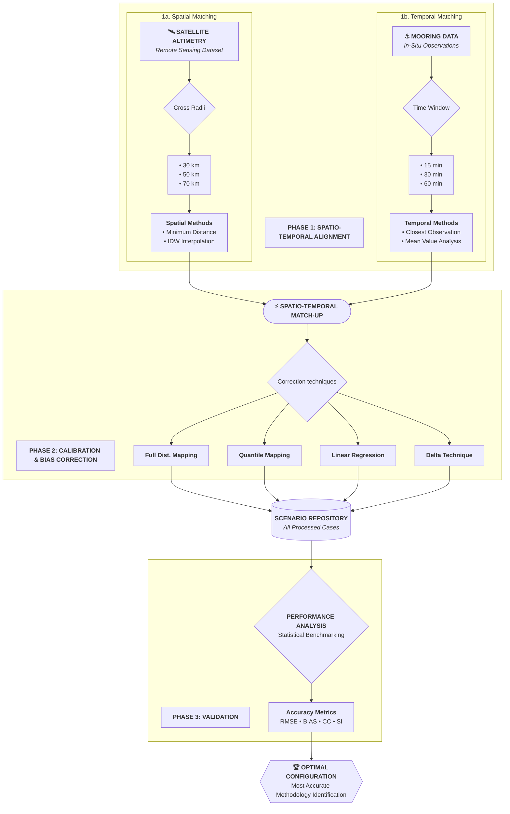

# Earth observation satellites for offshore wave and wind applications 🎓

### 📢 **Status: Work in Progress** 
*I am currently documenting the workflow and cleaning the code to better showcase the methodology used.*

## 🎯 Objective
This projects aims to improve accuracy and reliability of satellite data for offshore wave and wind applications. The goal is to apply several bias correction techniques to calibrate satellite data against in-situ data and evaluate which technique performs best.

## ✅ What this project does
-	**Spatial** and **temporal** **matching** to align satellite and in-situ data so that both data can be compared
-	To **reduce bias** in a dataset (i.e., to apply a bias correction technique), the dataset must be split into two parts: a _calibration dataset_, used to determine the calibration factors, and a _validation dataset_, used to validate the technique
-	In this project four BC techniques are presented: **_Delta method_**, **_Linear calibration_**, **_Full Distribution Mapping_** and **_Quantile Mapping_**
-	Export the final datasets as _.csv_ files for future use and make data analysis

## Quick Start
1) Create a virtual environment  
```bash
python -m venv venv
```

2) Activate it (Windows)  
```bash
venv\Scripts\activate
```

3) Install requirements  
```bash
pip install -r requirements.txt
```

4) Edit configuration  
`config/config.yaml`

5) Run the pipeline  
```bash
python scripts/main.py
```

## Context 🌊

 The Offshore Renewable Energy sector continuously requires accurate data, particularly
 regarding significant wave height and wind speed, which are key variables necessary
 to characterize the operational and environmental conditions of offshore wind farms.
 
 In this context, accurate data can support decision-making for a specific site to meet
 these conditions and, most importantly, facilitate continuous energy generation. In-situ
 platforms can help collect accurate data, but they are quite expensive and frequently
 experience malfunctions, leading to discontinuous observations.
 
 In this scenario, satellites play an important role as they are capable of acquiring accurate
 data with discrete temporal resolution.
 

## Goals 🎯

 This thesis aims to evaluate the performance of satellite altimetry data by collocating it
 with fixed-point positions, between satellite altimetry data and in-situ data, using a spatio
 temporal matching method, exploring different criterions.
 
 Moreover, several bias correction techniques are applied to calibrate satellite data against
 in-situ data to improve the quality of satellite assimilated dataset, aligning it more closely
 with in-situ and and unlock their potential in providing environmental insights.


## Workflow ⚡


```mermaid
graph TD
    %% Font e nodi stilizzati tramite sintassi nativa
    SAT["<b>🛰️ SATELLITE ALTIMETRY</b><br/><i>Remote Sensing Dataset</i>"]
    INS["<b>⚓ MOORING DATA</b><br/><i>In-Situ Observations</i>"]

    %% Fase 1
    subgraph " "
        direction TB
        L1["<div style='font-size:16px'><b>PHASE 1: SPATIO-TEMPORAL ALIGNMENT</b></div>"]
        
        subgraph "1a. Spatial Matching"
            direction TB
            SAT --> R{"Cross Radii"}
            R --> R_OPT["• 30 km<br/>• 50 km<br/>• 70 km"]
            R_OPT --> S_MET["<b>Spatial Methods</b><br/>• Minimum Distance<br/>• IDW Interpolation"]
        end

        subgraph "1b. Temporal Matching"
            direction TB
            INS --> W{"Time Window"}
            W --> W_OPT["• 15 min<br/>• 30 min<br/>• 60 min"]
            W_OPT --> T_MET["<b>Temporal Methods</b><br/>• Closest Observation<br/>• Mean Value Analysis"]
        end
    end

    %% Punto di Sincronizzazione
    S_MET --> SYNC([<b>⚡ SPATIO-TEMPORAL MATCH-UP</b>])
    T_MET --> SYNC

    %% Fase 2
    subgraph " "
        direction TB
        L3["<div style='font-size:16px'><b>PHASE 2: CALIBRATION & BIAS CORRECTION</b></div>"]
        
        SYNC --> BC{"Correction techniques"}
        
        BC --> BC1["<b>Full Dist. Mapping</b><br/>"]
        BC --> BC2["<b>Quantile Mapping</b><br/>"]
        BC --> BC3["<b>Linear Regression</b><br/>"]
        BC --> BC4["<b>Delta Technique</b><br/>"]
    end

    %% Fase 3
    BC1 & BC2 & BC3 & BC4 --> SAVE[(<b>SCENARIO REPOSITORY</b><br/><i>All Processed Cases</i>)]
    
    SAVE --> COMP{<b>PERFORMANCE ANALYSIS</b><br/>Statistical Benchmarking}

    subgraph " "
        direction TB
        L4["<div style='font-size:16px'><b>PHASE 3: VALIDATION</b></div>"]
        
        COMP --> METRICS["<b>Accuracy Metrics</b><br/>RMSE • BIAS • CC • SI"]
    end

    %% Output Finale
    METRICS --> FINAL{{"<b>🏆 OPTIMAL CONFIGURATION</b><br/>Most Accurate Methodology Identification"}}
```


## Repository Structure 📂

- [`Module_all_functions.py`](./Module_all_functions.py): Core library containing all shared functions used across the project.
- [`Spatio_temporal.py`](./Spatio_temporal.py): Implementation of the spatio-temporal matching algorithm and co-location logic.
- [`calibration.py`](./calibration.py): Script for applying the 4 bias correction techniques and generating comparative plots for the 10 datasets.

