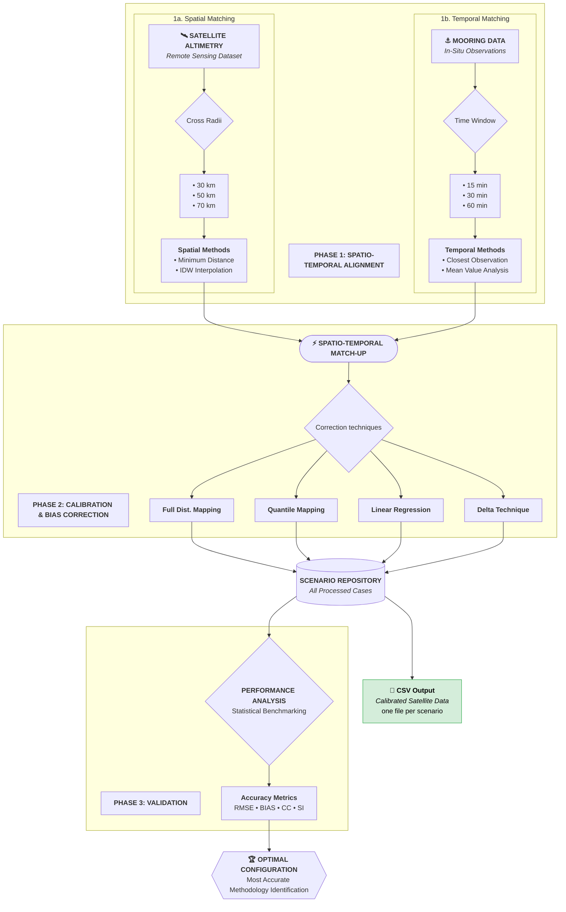

# 🎓 Earth observation satellites for offshore wave and wind applications

## 🌊 Project overview and context 

 The Offshore Renewable Energy sector continuously requires accurate data, particularly
 regarding significant wave height and wind speed, which are key variables necessary
 to characterize the operational and environmental conditions of offshore wind farms.
 
 In this context, accurate data can support decision-making for a specific site to meet
 these conditions and, most importantly, facilitate continuous energy generation. In-situ
 platforms can help collect accurate data, but they are quite expensive and frequently
 experience malfunctions, leading to discontinuous observations.
 
 In this scenario, satellites play an important role as they are capable of acquiring accurate
 data with discrete temporal resolution.
 

## 🎯 Objective
This projects aims to improve accuracy and reliability of satellite data for offshore wave and wind applications. The goal is to apply several bias correction techniques to calibrate satellite data against in-situ data and evaluate which technique performs best.

**The processing WORKFLOW is tailored to the specific metadata and data structures of the COPERNICUS MARINE SERVICE. Consequently, full compatibility and reliable results are guaranteed only when using datasets sourced from this platform.**

## ✅ What this project does
-	**Spatial** and **temporal** **matching** to align satellite and in-situ data so that both data can be compared
-	To **reduce bias** in a dataset (i.e., to apply a bias correction technique), the dataset must be split into two parts: a _calibration dataset_, used to determine the calibration factors, and a _validation dataset_, used to validate the technique
-	In this project four BC techniques are presented: **_Delta method_**, **_Linear calibration_**, **_Full Distribution Mapping_** and **_Quantile Mapping_**
-	Export the final datasets as _.csv_ files for future use and make data analysis

## ⚡ Workflow 
<details>
<summary>Workflow diagram</summary>


```mermaid
graph TD
    SAT["<b>🛰️ SATELLITE ALTIMETRY</b><br/><i>Remote Sensing Dataset</i>"]
    INS["<b>⚓ MOORING DATA</b><br/><i>In-Situ Observations</i>"]

    subgraph " "
        direction TB
        L1["<div style='font-size:16px'><b>PHASE 1: SPATIO-TEMPORAL ALIGNMENT</b></div>"]
        
        subgraph "1a. Spatial Matching"
            direction TB
            SAT --> R{"Cross Radii"}
            R --> R_OPT["• 30 km<br/>• 50 km<br/>• 70 km"]
            R_OPT --> S_MET["<b>Spatial Methods</b><br/>• Minimum Distance<br/>• IDW Interpolation"]
        end
        subgraph "1b. Temporal Matching"
            direction TB
            INS --> W{"Time Window"}
            W --> W_OPT["• 15 min<br/>• 30 min<br/>• 60 min"]
            W_OPT --> T_MET["<b>Temporal Methods</b><br/>• Closest Observation<br/>• Mean Value Analysis"]
        end
    end

    S_MET --> SYNC([<b>⚡ SPATIO-TEMPORAL MATCH-UP</b>])
    T_MET --> SYNC

    subgraph " "
        direction TB
        L3["<div style='font-size:16px'><b>PHASE 2: CALIBRATION & BIAS CORRECTION</b></div>"]
        
        SYNC --> BC{"Correction techniques"}
        
        BC --> BC1["<b>Full Dist. Mapping</b><br/>"]
        BC --> BC2["<b>Quantile Mapping</b><br/>"]
        BC --> BC3["<b>Linear Regression</b><br/>"]
        BC --> BC4["<b>Delta Technique</b><br/>"]
    end

    BC1 & BC2 & BC3 & BC4 --> SAVE[(<b>SCENARIO REPOSITORY</b><br/><i>All Processed Cases</i>)]

    SAVE --> CSV["<b>📄 CSV Output</b><br/><i>Calibrated Satellite Data</i><br/>one file per scenario"]

    SAVE --> COMP{<b>PERFORMANCE ANALYSIS</b><br/>Statistical Benchmarking}
    subgraph " "
        direction TB
        L4["<div style='font-size:16px'><b>PHASE 3: VALIDATION</b></div>"]
        
        COMP --> METRICS["<b>Accuracy Metrics</b><br/>RMSE • BIAS • CC • SI"]
    end

    METRICS --> FINAL{{"<b>🏆 OPTIMAL CONFIGURATION</b><br/>Most Accurate Methodology Identification"}}

    style CSV fill:#d4edda,stroke:#28a745,color:#000
```

</details>


## 📊 Future use
- **Data analysis for future datasets**
- **Integrate the workflow to other applications**

## 🛠️ Installation
<details> 
<summary>How to install dependencies</summary>
 
1) Create a virtual environment  
```bash
python -m venv venv
```

2) Activate it (Windows)  
```bash
venv\Scripts\activate
```

3) Install requirements  
```bash
pip install -r requirements.txt
```
</details>

 
## ▶️ Usage

<details>
<summary>Configuration parameters</summary>

```yaml
data_extraction:
  variable:
    var_name: "VAVH"
    field: "wave"
    depth_val: 0  # value expressed in meters
  dir_paths:
    dir_input_mooring_nc: ../data/example/moorings_nc
    dir_output_mooring_csv: ../data/example/moorings_csv
    dir_input_sat_csv: ../data/example/satellite_csv
# ---------------------------------------------------------------------
spatio_temp_matching:
  variable:
    var_name: "VAVH"
    cross_radius: 50
    cross_time_val: 15
    cross_time_unit: 'm' # m / h / s
  dir_paths:
    dir_output_mooring_csv: ../data/example/moorings_csv
    dir_input_sat_csv: ../data/example/satellite_csv
# ---------------------------------------------------------------------
bias_correction_techniques:
  technique: "linear" # "fdm" | "delta" | "qm" | "linear" | "all"
  output_dir: ../data/example/outputdata
```
### 🔍 Data extraction

| Parameter | Type | Description | Example |
| :--- | :--- | :--- | :--- |
| `var_name` | str | Variable name | VAVH
| `depth_val` | int | Depth value which the variable value will be extracted by | 0
| `dir_input_mooring_nc` | Path | Directory path of the moorings files .nc | data/examples/mooring_nc
| `dir_output_mooring_csv` | Path | Directory path of the moorings files .csv  | data/examples/mooring_csv
| `dir_input_sat_csv` | Path | Directory path of the satellite files data .csv  | data/examples/satellite_csv


### 🌎 Spatio-temporal matching

| Parameter | Type | Description | Example 
| :--- | :--- | :--- | :--- |
| `var_name` | str | Variable name | VAVH 
| `cross_radius` | float | Cross-radius value for the spatial matching | 50
| `cross_time_val` | float | Cross-time value for the temporal matching| 30
| `cross_time_unit` | char | Cross-time unit for the temporal matching| m
| `dir_output_mooring_csv` | Path | Directory path of the moorings files .csv | data/examples/mooring_nc
| `dir_input_sat_csv` | Path | Directory path of the satellite files data .csv | data/examples/satellite_csv

### 📊 Bias correction techniques

| Parameter | Type | Description | Example 
| :--- | :--- | :--- | :--- |
| `technique` | str | Technique used | delta
| `output_dir` | Path | Technique used | data/example/outputdata  


</details>

## ⬇️ Expected output
- Depending on the selected technique, from two to five files are generated, containing satellite dataframes as _.csv_ files
- __(WIP) In addition to these files, another file is generated containing the calibration factors.__

<br/>

<div align="center">
  
  <p><i>Typical outputs generated by the script</i></p>
</div>


<br/>

<div align="center">
  
  <p><i>Dataframe structure</i></p>
</div>


## 📂 Repository Structure 

- [`assets`](assets): Static files used by the project, such as images, icons, or pre-compiled binaries.
- [`config`](config): Global configuration files and environment settings (e.g., `.yaml` or `.env` templates).
- [`docs`](docs): Project documentation, API references, manuals, and architectural diagrams.
- [`legacy`](legacy): Deprecated code or older versions maintained for backwards compatibility or reference.
- [`data`](data): Local storage for datasets, raw input files, or temporary databases.
  - [`example`](data/example): Sample data files used for testing, demonstrations, or quick-start guides.

- [`src`](src): The primary source code for the application.
  - [`calibration`](src/calibration): Core algorithms for spatial and temporal matching, bias correction...
  - [`config`](src/config): Configuration modules to load the environment settings (e.g., `.yaml`)
  - [`io_data`](src/io_data): Modules handling Input/Output operations
  - [`processing`](src/processing): Core algorithms to process data


<br/>

# 📢 **Status: Work in Progress** 
*I am currently documenting the workflow and cleaning the code to better showcase the methodology used.*


